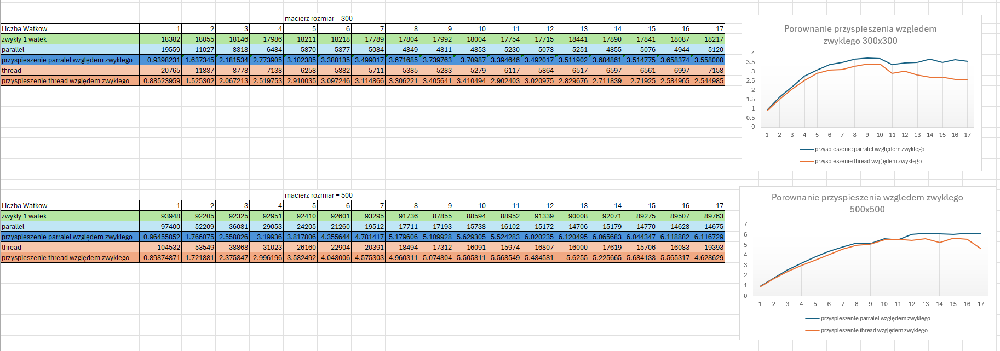

# Wielowątkowe przetwarzanie obrazów i mnożenie macierzy w technologii .NET  

---

## Wstęp  

Projekt został stworzony na platformie **.NET** (wersja 8.0) i implementuje dwa główne zadania:  
1. **Wielowątkowe mnożenie macierzy**: Porównanie wydajności obliczeń sekwencyjnych oraz równoległych z wykorzystaniem biblioteki Parallel i klasy Thread.  
2. **Wielowątkowe przetwarzanie obrazów**: Aplikacja okienkowa (Windows Forms), która umożliwia zastosowanie różnych filtrów na obrazie z wykorzystaniem wielowątkowości.  

---

## Opis funkcjonalności  

### 1. Wielowątkowe mnożenie macierzy (aplikacja konsolowa)  

1. **Generowanie macierzy**:  
   - Macierze są generowane losowo z wartościami w zakresie od 0 do 100.  
   - Użytkownik może określić rozmiar macierzy (domyślnie: 300x300).  

2. **Mnożenie macierzy**:  
   - **Sekwencyjne**: Obliczenia wykonywane na jednym wątku.  
   - **Parallel**: Obliczenia równoległe z wykorzystaniem biblioteki Parallel.  
   - **Thread**: Obliczenia równoległe z wykorzystaniem klasy Thread.  

3. **Pomiar czasu**:  
   - Program mierzy czas obliczeń dla każdego podejścia.  
   - Wyniki są uśredniane z 30 prób dla każdego rozmiaru macierzy i liczby wątków.  

4. **Analiza przyspieszenia**:  
   - Program oblicza przyspieszenie obliczeń równoległych względem sekwencyjnych.  
   - Wyniki są prezentowane w formie wykresu.  

---

### 2. Wielowątkowe przetwarzanie obrazów (aplikacja okienkowa)  

1. **Interaktywny interfejs użytkownika**:  
   - Użytkownik może wczytać obraz z pliku (obsługiwane formaty: JPG).  
   - Obraz jest wyświetlany w kontrolce PictureBox.  

2. **Przetwarzanie obrazu**:  
   - Aplikacja umożliwia zastosowanie czterech różnych filtrów:  
     - **Odcienie szarości (Grayscale)**.  
     - **Negatyw (Negative)**.  
     - **Progowanie (Threshold)**.  
     - **Odbicie lustrzane (Mirror)**.  
   - Każdy filtr jest przetwarzany w osobnym wątku, co pozwala na równoległe przetwarzanie obrazu.  

3. **Wyświetlanie wyników**:  
   - Oryginalny obraz oraz obrazy przetworzone są wyświetlane w osobnych kontrolkach PictureBox.  

---

## Pliki programu oraz ich przeznaczenie  

### Aplikacja konsolowa  

#### **Program.cs**  
- Główna logika aplikacji konsolowej.  
- Generuje macierze, wykonuje mnożenie macierzy i mierzy czas obliczeń.  
- Wyświetla wyniki w konsoli.  

#### **Matrix.cs**  
- Klasa reprezentująca macierz.  
- Zawiera:  
  - Właściwości `Rows`, `Cols` i `Data` (tablica przechowująca dane macierzy).  
  - Metody:  
    - `FillRandom()` - wypełnia macierz losowymi wartościami.  
    - `Print()` - wyświetla macierz w konsoli.  

#### **MatrixMultiplier.cs**  
- Klasa zawierająca implementację algorytmów mnożenia macierzy:  
  - **MultiplySequential**: Mnożenie sekwencyjne (wykonywane na jednym wątku).  
  - **MultiplyParallel**: Mnożenie równoległe z wykorzystaniem biblioteki Parallel.  
  - **MultiplyWithThreads**: Mnożenie równoległe z wykorzystaniem klasy Thread.  

---

### Aplikacja okienkowa  

#### **Form1.cs**  
- Logika aplikacji okienkowej.  
- Obsługuje interaktywny interfejs użytkownika:  
  - Wczytywanie obrazu z pliku.  
  - Przetwarzanie obrazu za pomocą czterech filtrów (Grayscale, Negative, Threshold, Mirror).  
  - Wyświetlanie oryginalnego obrazu oraz obrazów przetworzonych w kontrolkach PictureBox.  

#### **Filtry obrazu**  
- **ApplyGrayscale**: Konwertuje obraz na odcienie szarości.  
- **ApplyNegative**: Tworzy negatyw obrazu.  
- **ApplyThreshold**: Zastosowuje progowanie obrazu (czarno-biały obraz na podstawie progu).  
- **ApplyMirror**: Tworzy odbicie lustrzane obrazu.  

---

## Działanie programu  

### Aplikacja konsolowa  

1. **Generowanie macierzy**:  
   - Program generuje dwie macierze o rozmiarze 300x300 wypełnione losowymi wartościami.  

2. **Mnożenie macierzy**:  
   - Program wykonuje mnożenie macierzy dla różnych liczby wątków (od 1 do 17).  
   - Dla każdego podejścia (sekwencyjne, Parallel, Thread) mierzy czas obliczeń.  

3. **Analiza wyników**:  
   - Program oblicza przyspieszenie obliczeń równoległych względem sekwencyjnych.  
   - Wyniki są prezentowane w formie wykresu.  

### Aplikacja okienkowa  

1. **Wczytywanie obrazu**:  
   - Użytkownik wybiera obraz z pliku za pomocą kontrolki OpenFileDialog.  
   - Oryginalny obraz jest wyświetlany w kontrolce PictureBox.  

2. **Przetwarzanie obrazu**:  
   - Po kliknięciu przycisku "Uruchom", każdy filtr jest przetwarzany w osobnym wątku.  
   - Wyniki przetwarzania są wyświetlane w osobnych kontrolkach PictureBox.  

---

## Wyniki eksperymentu  

### Wykres wyników  

  

---

## Wnioski  

1. **Sekwencyjne obliczenia**:  
   - Obliczenia sekwencyjne były wykonywane na jednym wątku, co stanowi punkt odniesienia dla analizy przyspieszenia.  

2. **Parallel vs Thread**:  
   - Biblioteka Parallel osiąga lepsze przyspieszenie niż klasa Thread dla większości przypadków.  
   - Parallel jest bardziej wydajna przy większej liczbie wątków, ponieważ automatycznie optymalizuje rozkład obliczeń.  

3. **Przetwarzanie obrazów**:  
   - Zastosowanie wielowątkowości pozwala na równoczesne przetwarzanie obrazu za pomocą różnych filtrów, co znacząco skraca czas przetwarzania.  

---

## Wykorzystane technologie  

- **.NET (wersja 8.0)**  
- **C#**  
- **Biblioteka Parallel** (wysokopoziomowe zrównoleglenie).  
- **Klasa Thread** (niskopoziomowe zrównoleglenie).  
- **Stopwatch** (pomiar czasu obliczeń).  
- **Windows Forms** (do aplikacji okienkowej).  
